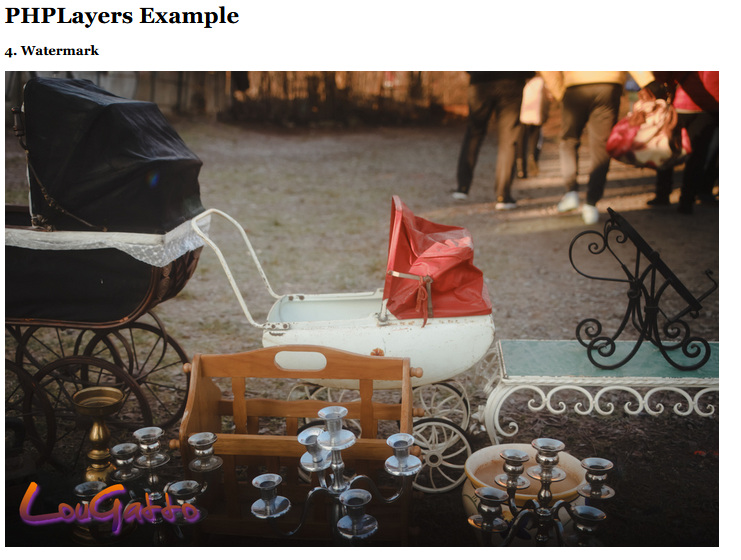

# PHP Layers

This library allows to easily create layered images using PHP and GD library. 
Previously developed as GDWrapper, was powering a rendering engine for
Map Previews in Unreal Tournament Stats Tracker:


<<<<<<< HEAD
## Example 1: a meme
Create a heavily outdated meme with just a few lines of code.
```php
// import image as background
$layersImg = GDW\Image::createFromFile(__DIR__ . "/eins.jpg");

// make things more THUG
$thugLayer = GDW\Layer::createFromFile(__DIR__ . "/thug.png");
// attach the layer to image, so we can move things around
$layersImg->addLayerTop($thugLayer);
// we're going to move the thug layer to a fixed position
// make selection (like CTRL+A), then drag the contents, and finally apply the result.
$thugLayer->select()->move(290, 95)->apply();

// create watermark layer
$watermarkLayer = GDW\Layer::createFromFile(__DIR__ . "/cheesymemz.png");
$layersImg->addLayerTop($watermarkLayer);
// moving the watermark to bottom left corner
$watermarkLayer->select()->move(0, GDW\IMAGE_BOTTOM)->apply();

=======
## Example: adding watermark to photo



```
// import image as background
$layersImg = GDW\Image::createFromFile(__DIR__ . "/stroller.jpg");

// add watermark layer
$watermarkLayer = GDW\Layer::createFromFile(__DIR__ . "/lg_watermark.png");
// naming is optional
$watermarkLayer->name = "Watermark layer";
// let's put the watermark layer on top of the image
$layersImg->addLayerTop($watermarkLayer);

// we select (like CTRL+A), then drag the contents, and finally apply the result.
$watermarkLayer->select()->move(0, GDW\IMAGE_BOTTOM)->apply();
>>>>>>> ead0d4bcaf22c6cba23a93956c2bbcb86e301cfc

// export the image as data URL
$dataUrl = $layersImg->getDataUrlPNG();
echo "<br/>";
```
<<<<<<< HEAD


The image is made of 3 layers, including the background. With additional line of code, you can show individual layers:
```php
$layersImg->setComposer(new GDW\Composers\TiledComposer());

$dataUrl = $layersImg->getDataUrlPNG();
echo "<br/>";
```

=======
>>>>>>> ead0d4bcaf22c6cba23a93956c2bbcb86e301cfc

## Example: rich text
The library has capability to render formatted blocks of text, and also non-overlapping text. This will be documented in future.


