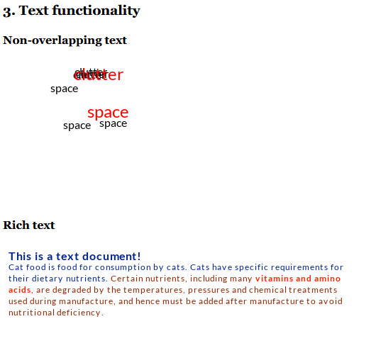

# PHP Layers

PHP-Layers is a OOP library for creating images in PHP. 

It adds powerful layering functionality known from image editors, while staying intuitive and simple to use. 

The library supports:
- Creating layers, positioning and reordering
- Importing images from common formats (JPG, PNG)
- Exporting with transparency out-of-box
- Generating Data URL for embedding in HTML file
- Convinience functions for drawing
- Rendering of rich text with word wrapping

**The project should be considered unstable for now, as I'm refactoring the code from an unhinged mess I made 10 years ago.**

## Example 1: a meme
Create a heavily outdated meme with just a few lines of code.


```php
use Naomai\PHPLayers\Image;

// import image as background
$layersImg = Image::createFromFile("eins.jpg");

// create watermark layer
$watermarkLayer = $layersImg->newLayer()->importFromFile("cheesymemz.png");

// move the watermark to bottom left corner.
// 1. make selection (like CTRL+A)
// 2. then drag the contents, 
// 3. finally apply the result.
$watermarkLayer
    ->selectSurface()
    ->move(0, Image::IMAGE_BOTTOM)
    ->apply();


// make things more THUG
$thugLayer = $layersImg->newLayer()->importFromFile("thug.png");

// moving to a fixed position
$thugLayer
    ->selectSurface()
    ->move(290, 95)
    ->apply();

// export the image as data URL
$dataUrl = $layersImg->getDataUrlPNG();
echo "<br/>";
```
The image is made of 3 layers, including the background. If we add an extra line, we can show all the layers as a split view:

```php
// TiledComposer is putting all layers in a grid, instead of merging them
$layersImg->setComposer(new PHPLayers\Composers\TiledComposer());

// export the image as data URL
$dataUrl = $layersImg->getDataUrlPNG();
echo "<br/>";
```

## Use cases

Previously developed as GDWrapper, was powering a rendering engine for
Map Previews in Unreal Tournament Stats Tracker:


## Example: rich text
The library has capability to render formatted blocks of text, and also non-overlapping text. This will be documented in future.



