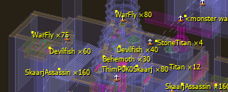

# Phancake
## About
Phancake is a OOP library for creating images in PHP. 

It adds powerful layering functionality known from image editors, while staying intuitive and simple to use. 

- PHP 8.0+
- GD2 extension
- Stacking of images, with transparency
- Importing and exporting images - supports classic and modern formats (PNG, JPEG, WebP, AVIF). 
  - Also, allows generating Data URL for embedding in HTML file
- Convinience functions for drawing
- Rich text

**The project should be considered unstable for now, as I'm refactoring the code from an unhinged mess I made 10 years ago.**

## Phan-wha?!
This is a dev branch for PHP-Layers, where all the refactoring will take place. As this might involve some major-breaking-changes, the stable version of thie library will be renamed to Phancake.

The image is a pancake of different layers. And Phan, because PHP is an *Elephant language*.

## Example
Create a heavily outdated meme with just a few lines of code.

```php
use Naomai\Phancake\Image;

// import image as background
$layersImg = Image::createFromFile("eins.jpg");

// create a watermark layer from file, and move it to bottom left corner
$watermarkLayer = $layersImg->newLayer()->importFromFile("cheesymemz.png");
$watermarkLayer
    ->selectSurface()
    ->move(x: 0, y: Image::IMAGE_BOTTOM)
    ->apply();

// make things more THUG
$thugLayer = $layersImg->newLayer()->importFromFile("thug.png");
$thugLayer
    ->selectSurface()
    ->move(x: 290, y: 95)
    ->apply();

// export the image, and include it in the HTML file
$dataUrl = $layersImg->export()->asDataUrl("webp");
echo "<br/>";
```


The image is made of 3 layers, including the background. If we add an extra line, we can show all the layers as a split view:

```php
// TiledComposer is putting all layers in a grid, instead of merging them
$layersImg->setComposer(new Phancake\Composers\TiledComposer());

$dataUrl = $layersImg->export()->asDataUrl("webp");
echo "<br/>";
```


## Use cases

Previously developed as GDWrapper, was powering a rendering engine for
Map Previews in Unreal Tournament Stats Tracker:


## Text features
Phancake includes two additional methods for adding text to your images. 

**Those features need heavy refactoring, and will be documented when they become stable.**

### Rich text
Capability to render formatted blocks of text. Change font, make it bold, mark it red in the middle of paragraph. 
We take care of the text flow. 


### Non-overlapping text
Spread different text labels, so they don't overlap. Useful for auto-generated images with tooltips.


