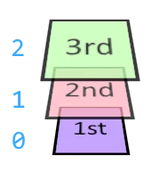

# Documentation
For readability, every class under PHPLayers namespace is referred using only its name. 
This is equivalent to placing `use Naomai\PHPLayers;` in the code.

For example:

- `Image` refers to fully-qualified name `Naomai\PHPLayers\Image`
- `Generators\NonOverlappingText` refers to `Naomai\PHPLayers\Generators\NonOverlappingText`
- `\InvalidArgumentException` is the builtin PHP class in global namespace

# Image
`Image` is the main class, containing all layers, properties and 
settings on how to compose the final image.

## Create new image
`Image` can be instantiated using three ways:

### Empty image with dimensions
`Image::__construct(int $width, int $height, $createLayer = true)` 

Create new image with given dimensions.
- `width`, `height` - dimensions in pixels
- `createLayer` - if true, a background layer is automatically created. 
This layer is fully transparent.

```php
$image = new Image(width: 50, height: 50, createLayer: true);
$background = $image->getLayerByIndex(0);
```

### createFromFile - import from file
`Image::createFromFile(string $fileName) : Image`

Import image file into new PHP Layers Image object. The new image contains
one layer with imported image as its content.

- `fileName` - path of existing image file

`\RuntimeException` is thrown, if the file is not existing, or is not a valid image.

**Returns** `Image` imported from file

```php
$image = Image::createFromFile("olympic.jpg");
```

### createFromGD - import from PHP
`Image::createFromGD(\GdImage $gdHandle) : Image`

Wrap existing GD2 image into new PHP Layers Image object. The new image contains
one layer with its content **copied** from original image.

- `gdHandle` - the handle of source GD2 Image.

**Returns** `Image` with contents of source `\GdImage`

```php
$gdImage = imagecreatefromjpeg("olympic.jpg");
$image = Image::createFromGD($gdImage);
```

## Exporting (saving)
Saving the result is possible through method `export()`. The method exposes
most common ways of delivering images. More detailed info can be found
in [Helpers\ImageExporter](#helpers-imageexporter) class.

### export - examples
```php
// send the image to browser directly, as JPEG
$image->export()->toBrowser(format: 'jpg'); 

// save on the disk
$image->export()->asFile(fileName: 'img/cherry.png', format: 'png');   

// create `data:...` URL for embedding in HTML
// omitting `format` exports image as PNG by default
$url = $image->export()->asDataUrl(); 

// raw binary data of image in WEBP format
$data = $image->export()->asBinaryData(format: 'webp');
```

### getMerged
`Image::getMerged() : Layer`

Finalize image into Layer object.

Merges all layers in image layer set using current layer composer.
The result is a new `Layer` object. The original layer set is left intact.

The new layer **is not attached** to the image. This means
you cannot use reordering functions on it.

**Returns** Layer object containing merged content of image.

 
```php
$layerTwo = $image->getMerged();
```

### getMergedGD
`Image::getMerged() : \GdImage`

Finalize image into GD2 image handle.

Merges all layers in image layer set using current layer composer.
The result is a GD2 image handle accessible by native PHP functions.
The original layer set is left intact.

**Returns** `\GdImage` handle containing merged content of image
 
```php
$layerTwo = $image->getMerged();
```

## Managing layers
PHPLayers makes use of a *Layer Stack*. This structure gives flexibility on
which layer goes on top of other. Now, the things going on the top
don't have to be drawn at the very end of script.



`LayerStack` is a sequence of layers, beginning at index 0 (bottom), 
then going up to the top. PHPLayers allows *reordering* of layers
after their creation. The *Layer index* is referring to order of the stack,
not the order of creating layers.

`Layer` is *attached* to the `Image`, when it is present on its Layer Stack.


### newLayer
`Image::newLayer(string $name=null) : Layer`

Create new layer and put it on top of layer stack. 

- `name` (optional) - label shown when image is rendered using .

**Returns** New `Layer` object attached to the `Image`

```php
$layerOne = $image->newLayer();
```

### getLayerByIndex
`Image::getLayerByIndex(int $id) : ?Layer`

Gets the Layer object from layer set using its index.

- `id` - a zero-based index of the layer in Layer Stack, counting from the bottom. 
If negative, count from the last layer.


**Returns** `Layer` object matching the index provided, or `null` if invalid.

```php
// $image has 3 layers
$layerBottom = $image->getLayerByIndex(0);
$layerTop = $image->getLayerByIndex(2);
$layerTop = $image->getLayerByIndex(-1); // same layer as above
$layerOutOfBounds = $image->getLayerByIndex(3); // null
```

### reorder
`Image::reorder(Layer $layerToMove) : Helpers\LayerReorderCall`

Access helper object for changing layer order on stack.

- `layerToMove` - a `Layer` to be relocated, **must** be attached to the `Image`

**Returns** helper object providing reordering methods. The available methods
of such object can be found in 
[Helpers\LayerReorderCall](#helpers-layerreordercall) class.

```php
$image->reorder($layerBottom)->putOver($layerTop);
```

### layerPutTop
`Image::layerPutTop(Layer $layerObj) : int`

Puts a layer object to the top of image's Layer Stack.

*Inserted layer is drawn over the existing image.*

This method also *attaches* layer to the image.
If the layer is already on the stack, it will be moved from its
previous place.


- `layerObj` - `Layer` to be put

**Returns** New *Layer index* of the layer in Stack

```php
$image->layerPutTop($layerTwo);
```

### layerPutBottom
`Image::layerPutBottom(Layer $layerObj) : int`

Puts a layer object to the bottom of image's Layer Stack.

*Inserted layer is drawn behind the existing image.*

This method also *attaches* layer to the image.
If the layer is already on the stack, it will be moved from its
previous place.


- `layerObj` - `Layer` to be put

**Returns** New *Layer index* of the layer in Stack

```php
$image->layerPutBottom($layerTwo);
```

### getLayerCount
`Image::getLayerCount() : int`

Get number of layers attached to the image.

**Returns** number of layers

```php
$image = new Image(width: 100, height: 100);
$countLayers = $image->getLayerCount(); 
// $countLayers == 1
```


### getLayerStack
`Image::getLayerStack() : LayerStack`

Access the `LayerStack` of the image.

**Returns** `LayerStack` object containing all the layers of image

